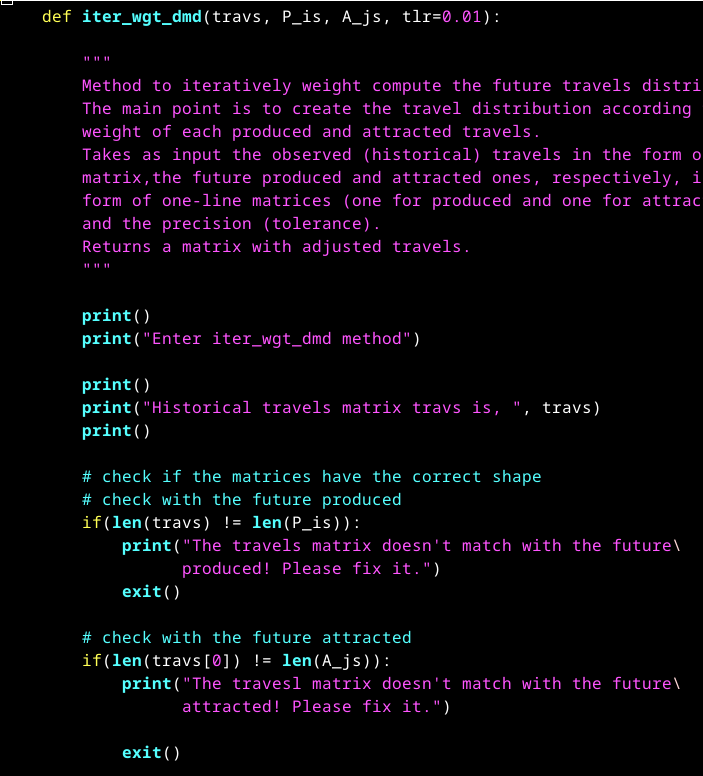

# Project Name
> Transportation Short Term Demand Methods/Models

## Table of contents
* [General info](#general-info)
* [Screenshots](#screenshots)
* [Technologies](#technologies)
* [Setup](#setup)
* [Features](#features)
* [Status](#status)
* [Inspiration](#inspiration)
* [Contact](#contact)

## General info
The object of the present project is to code three in use methods for short
term transportation demand, i.e., Furness, Fratar and Detroit. Additionally,
an original new method is proposed. The motivation is based on the need to
create helper piece of code to work with my student classes and personal projects.

## Screenshots

## Technologies
* Python3 and its math module
* matplotlib (later to be used in order to generate the appropriate graphs)

## Setup
Just read the docstrings and be carefull to matrices dimensions

## Code Examples
Show examples of usage:
`class GravitMod()`

## Features
List of features ready and TODOs for future development
* ~~Get ready the README file and the project outline.~~
* ~~Code the class to contain the needed methods.~~
* ~~Code the new method.~~
* Code Fratar method.
* Code Detroit method.
* ~~Code Furness method.~~
~~* Code Gravitational Model method in order to establish a baseline.~~
* Code two methods (classical and weighted) to determine the Gravitational Model calibration coefficients.
* Break spaghetti in clean code (late task).
  
To-do list:
* ~~Code Furness method.~~
* ~~Code Fratar method.~~
* ~~Code Gravitational Model method.~~
* Code Fratar method.
* Code Detroit method.
* Code methods to determine the GM calibration coefficients.

## Status
Project is: _in progress_

## Inspiration
(Too) many online and library sources.

## Contact
rdt333@gmail.com - feel free to contact me!
